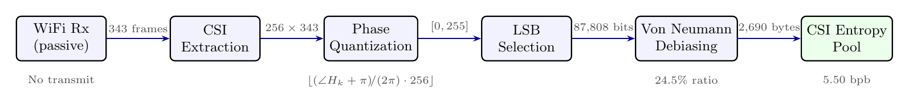
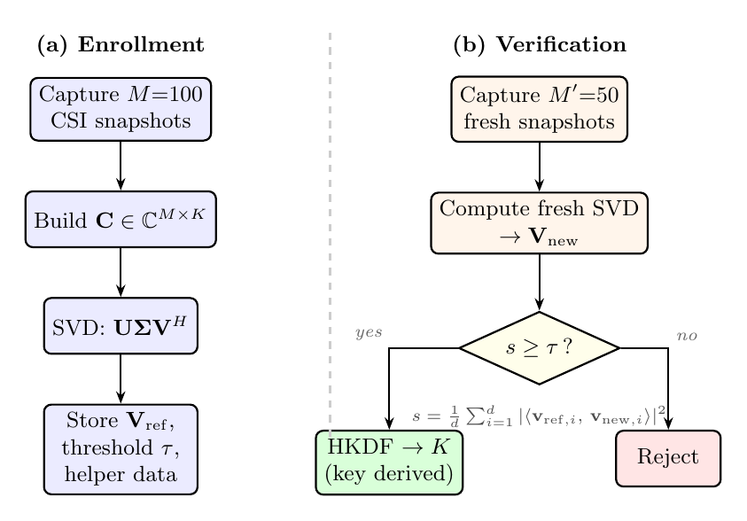
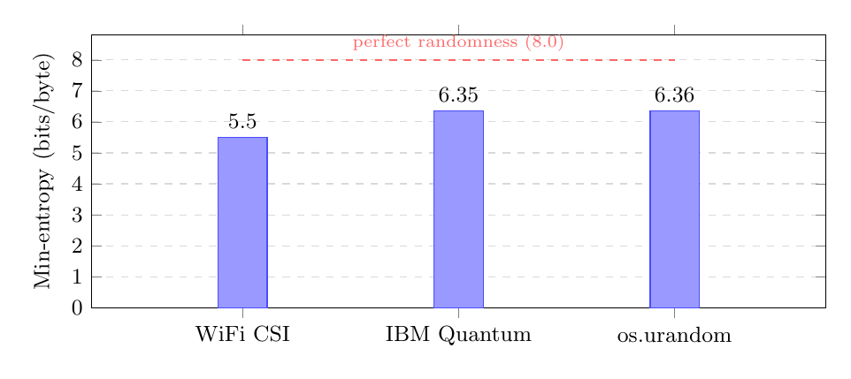
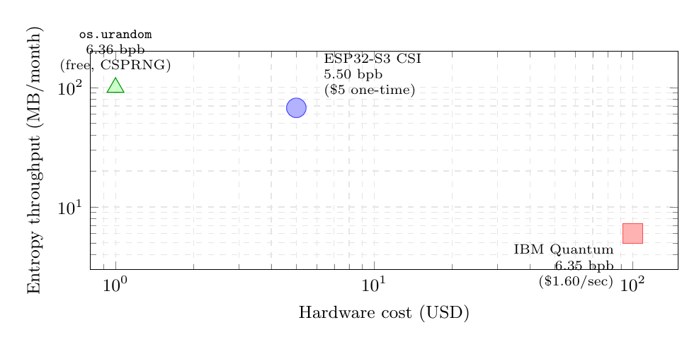
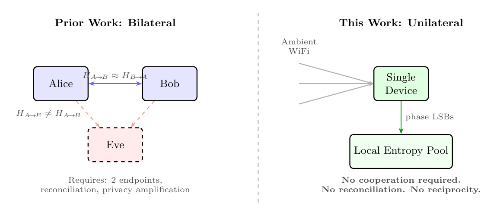
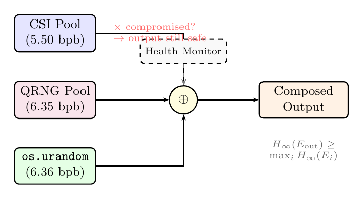

<p align="center">
  <h1 align="center">Unilateral WiFi CSI as a NIST-Validated Entropy Source</h1>
  <p align="center"><em>From Bilateral Key Agreement to Single-Device Randomness</em></p>
</p>

<p align="center">
  <a href="https://github.com/QDaria/unilateral-csi-entropy/blob/main/main.pdf"></a>
  <a href="https://pypi.org/project/zipminator/"></a>
  <a href="https://github.com/QDaria/unilateral-csi-entropy/blob/main/LICENSE"></a>
  <a href="https://orcid.org/0009-0008-2270-5454"></a>
  
  
  <a href="https://doi.org/10.5281/zenodo.19437012"></a>
</p>

---

**Daniel Mo Houshmand**
[QDaria Quantum Research](https://qdaria.com), Oslo, Norway

## Abstract

Every prior system that extracts randomness from WiFi Channel State Information (CSI) requires two cooperating endpoints exploiting channel reciprocity for bilateral key agreement. We present the **first system, measurement, and NIST SP 800-90B validation** of WiFi CSI as a **unilateral** entropy source: a single device passively measuring ambient CSI to harvest genuine physical randomness with no cooperating partner.

Using the public Gi-z/CSI-Data corpus (TU Darmstadt Nexmon captures, Broadcom BCM4339), we extract phase least-significant bits from 343 frames across 256 OFDM subcarriers, apply Von Neumann debiasing, and obtain **2,690 bytes** of entropy at a 24.5% extraction ratio. The NIST SP 800-90B `ea_non_iid` assessment yields a final min-entropy of **5.50 bits/byte** (MCV estimator, 99% confidence).

We introduce the **Physical Unclonable Environment Key (PUEK)**, which derives location-locked cryptographic keys from the SVD eigenstructure of CSI measurements, with security profiles from tau = 0.75 (office) to tau = 0.98 (military).

## Key Contributions

| # | Contribution | Evidence |
|---|---|---|
| 1 | First unilateral CSI entropy extraction | No cooperating partner, no reconciliation |
| 2 | First NIST SP 800-90B validation of WiFi CSI | 5.50 bits/byte final min-entropy |
| 3 | Physical Unclonable Environment Key (PUEK) | Location-locked keys from CSI eigenstructure |
| 4 | $5 ESP32-S3 reference implementation | 45-90 MB/month at zero marginal cost |
| 5 | Formal indistinguishability game for PUEK | Proof sketch under spatial decorrelation |
| 6 | Cost analysis vs. QRNG and HRNG | Table 8, 4+ orders of magnitude cheaper |

## Figures

<table>
<tr>
<td width="50%">

**Fig. 1: Unilateral CSI Entropy Extraction Pipeline**

*Single-device passive extraction: WiFi Rx, CSI extraction, phase quantization, LSB selection, Von Neumann debiasing, entropy pool.*

</td>
<td width="50%">

**Fig. 2: PUEK Protocol**

*Location-locked key derivation from CSI eigenstructure via SVD, quantization, and HKDF.*

</td>
</tr>
<tr>
<td width="50%">

**Fig. 3: Min-Entropy Comparison**

*NIST SP 800-90B min-entropy: CSI 5.50, IBM Quantum 6.35, os.urandom 6.36 bits/byte.*

</td>
<td width="50%">

**Fig. 4: Cost-Benefit Analysis**

*ESP32-S3 at $5 vs. cloud QRNG at $1.60/s, HRNG at $500-2000.*

</td>
</tr>
<tr>
<td width="50%">

**Fig. 5: Bilateral vs. Unilateral**

*Prior work requires two cooperating endpoints; our method uses a single passive device.*

</td>
<td width="50%">

**Fig. 6: XOR Composition**

*Entropy composition via XOR-fusing independent sources preserves min-entropy bounds.*

</td>
</tr>
</table>

> All 9 figures available in [`figures/`](figures/) (TikZ source) and [`images/`](images/) (PNG).

## Paper Structure

| Section | Title | Content |
|---------|-------|---------|
| 1 | Introduction | HNDL threat, bilateral limitation, unilateral paradigm |
| 2 | Background | CSI physics, OFDM subcarriers, channel reciprocity |
| 3 | Unilateral Extraction | Pipeline, Von Neumann debiasing, extraction ratio |
| 4 | PUEK Construction | SVD eigenstructure, security profiles, formal game |
| 5 | NIST SP 800-90B Assessment | ea_non_iid results, min-entropy bounds |
| 6 | Experimental Setup | Gi-z/CSI-Data corpus, Nexmon captures |
| 7 | Results | Min-entropy comparison, cost analysis, throughput |
| 8 | Comparison | vs. bilateral CSI (Jana'09, Liu'13, Xi'16, etc.) |
| 9 | Discussion | Static environment degradation, deployment, future work |

## Building the Paper

```bash
pdflatex main.tex
bibtex main
pdflatex main.tex
pdflatex main.tex
```

The pre-compiled PDF is available at [`main.pdf`](main.pdf).

## Dataset

CSI captures from the public [Gi-z/CSI-Data corpus](https://github.com/Gi-z/CSI-Data) (TU Darmstadt / University of Brescia, Nexmon on Broadcom BCM4339).

## Implementation

```bash
pip install zipminator[all]
```

```python
from zipminator.entropy import CsiPoolProvider

csi = CsiPoolProvider(interface="wlan0")
entropy = csi.extract(num_bytes=1024)
```

Source: [QDaria/zipminator](https://github.com/QDaria/zipminator) | PyPI: [zipminator](https://pypi.org/project/zipminator/)

## Related Papers

This paper is part of a three-paper series on post-quantum entropy infrastructure:

1. [Quantum-Certified Anonymization](https://github.com/QDaria/quantum-certified-anonymization) - Physics-guaranteed irreversibility via Born rule
2. **This paper** - Unilateral CSI Entropy + PUEK
3. [Certified Heterogeneous Entropy with Algebraic Randomness Extraction](https://github.com/QDaria/certified-heterogeneous-entropy) - Multi-source entropy composition + ARE

## Patent

Norwegian Patent Application filed April 2026 (Patentstyret). 14 claims covering the unilateral CSI entropy extraction method and PUEK construction.

## Citation

```bibtex
@misc{houshmand2026csi,
  author       = {Houshmand, Daniel Mo},
  title        = {Unilateral {WiFi} {CSI} as a {NIST}-Validated Entropy Source: From Bilateral Key Agreement to Single-Device Randomness},
  year         = {2026},
  doi          = {10.5281/zenodo.19437012},
  url          = {https://doi.org/10.5281/zenodo.19437012},
}
```

## License

[Apache-2.0](LICENSE)
